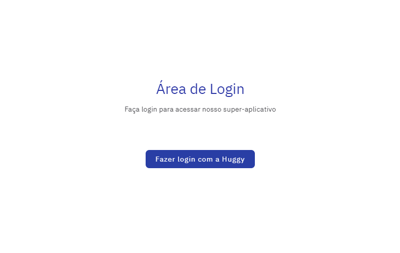
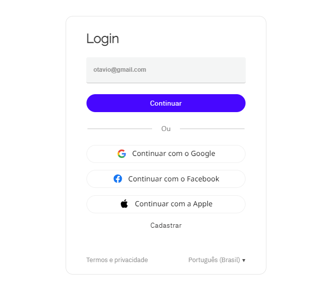
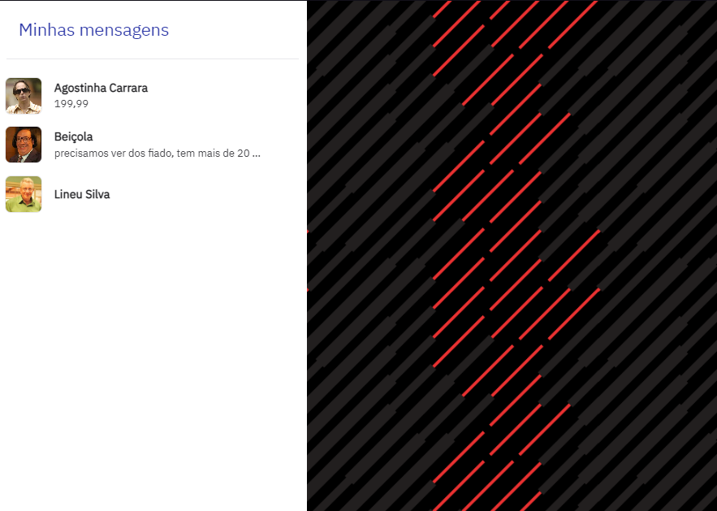
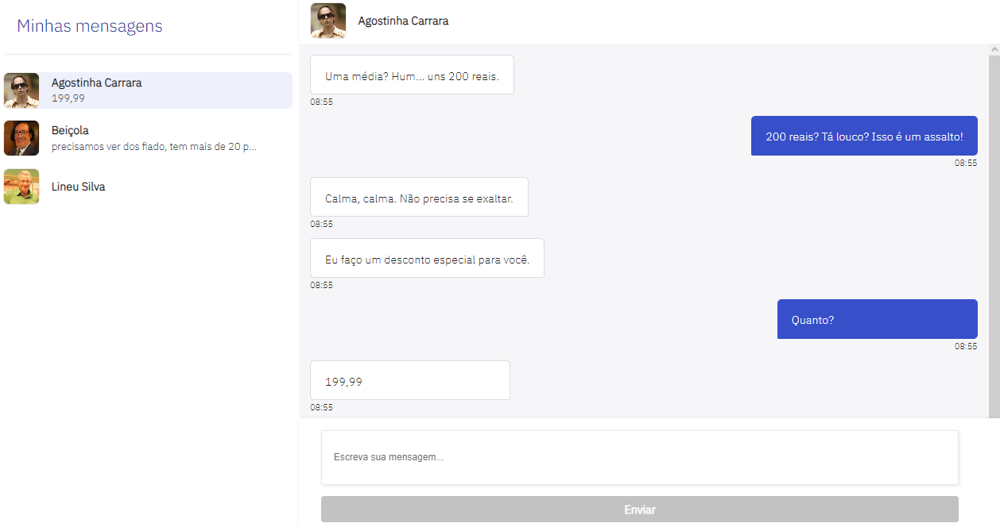
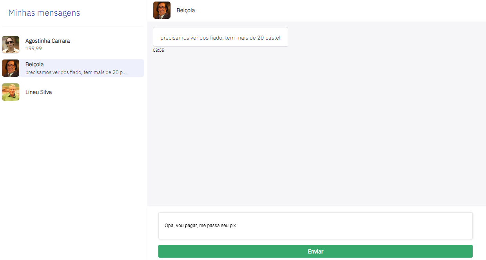
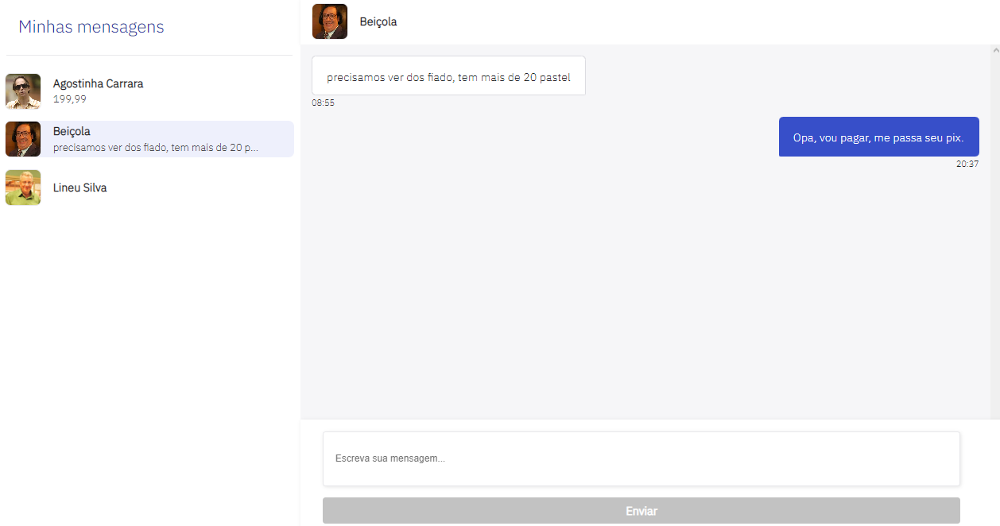

# Desafio-Huggy

- Desafio para a vaga de Front-End utilizando Vue Js. 🌳


## Desafio

- Listagem dos atendimentos, com foto e nome e última mensagem trocada ✔️
- Listagem de mensagens mensagens trocadas durante a conversa; ✔️
- Exibir as informações do contato: nome e foto; ✔️
- Envio de uma nova mensagem; ✔️
- Funcional em diversos layouts ✔️

## Instalação

1. Passo - Instale desafio-huggy com o instalador de pacotes de sua preferência

```bash
# npm
npm install

# pnpm
pnpm install

# yarn
yarn install
```

## Execução

2. Passo - Inicie o servidor pela url `http://localhost:3000`:

```bash
# npm
npm run dev

# pnpm
pnpm run dev

# yarn
yarn dev
```

## Rodando o NoSQL (*Importante*)

3. Passo - Para ver informações de chat e enviar mensagens, execute o comando abaixo

```bash
# npm
npm run json-server

# pnpm
pnpm run json-server

# yarn
yarn json-server
```

## Link para teste

- É necessário rodar o passo anterior (3° Passo) para acessar as informações de chat
- https://huggy-challenger.netlify.app

## Funcionalidades

- Area inicial


  
- Area de login ( Necessário inserir um email valido )


  
- Página de chats



- Exemplo de chat


  
- Exemplo de troca de texto



- Exemplo de envio de texto concluído


